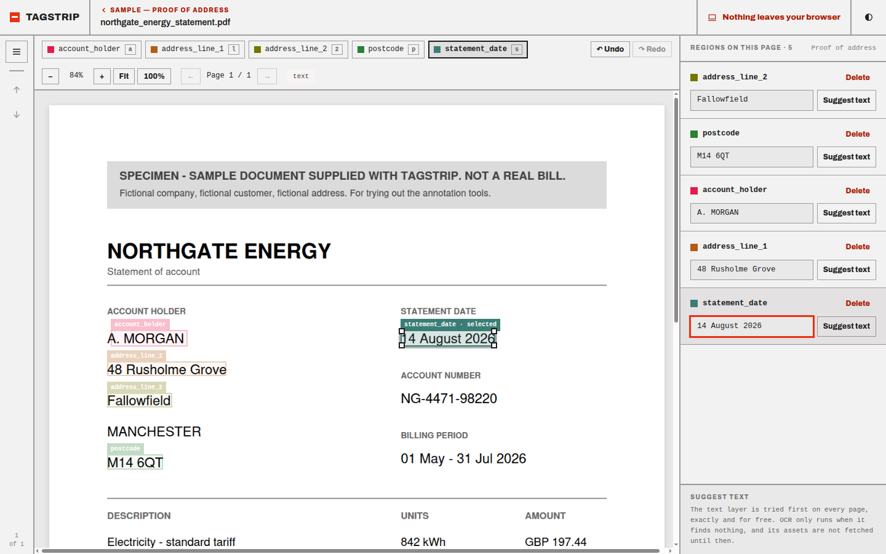

# TagStrip

A browser-based tool for drawing labeled bounding boxes on document pages (PDFs or images), with
a per-box text transcription field — built for preparing training/test data for
document-understanding pipelines (KYC field extraction, ID parsing, invoice parsing, and similar).

Renders PDFs directly via [pdf.js](https://mozilla.github.io/pdf.js/); no server-side
pre-processing step, and no server at all.



## Why

Most bounding-box annotation tools assume a text layer already exists to copy from, or need a
backend to store projects and images. TagStrip is built for the opposite case: scanned or
image-only documents where the transcription itself is part of what you're labeling, and for
people who want to run entirely offline with no account, no upload to a third party, and no
server to stand up.

## Features

- Rectangle (bounding box) annotation, each with an editable **text transcription field**
- User-defined, reusable **label schemas** (name, color, optional 1–9 hotkey per label) —
  create once, reuse across projects
- **Projects**: a project pairs one label schema with a set of uploaded documents and their
  annotations
- PDF and image upload, multi-page documents, with pages rasterized lazily (only when you
  actually view them, not all up front) so large PDFs stay responsive
- **Per-page content-type detection** (`text` / `scanned` / `unknown`), auto-detected from
  pdf.js's text layer at upload time, with manual override, plus a free-form notes field per
  document
- Local persistence via IndexedDB — reload the page, everything's still there
- **Import/export**: a self-describing native JSON format (round-trips a whole project, including
  the source documents) and a best-effort **Label Studio-compatible export**
- **"Suggest text"** per box: exact text-layer extraction when the page has one (instant, no
  model), falling back to on-device OCR ([Tesseract.js](https://tesseract.projectnaptha.com/))
  only when there's no text layer to read from — auto-detecting across every bundled language
  (English, Chinese Simplified/Traditional, Malay, Tamil, Thai, Vietnamese today) in one pass, no
  language picker needed. The OCR engine and its language data are self-hosted (no CDN) and only
  downloaded the first time OCR is actually needed
- Undo/redo, keyboard-driven workflow (hotkeys per label, arrow-key page nav, Delete key), and a
  responsive layout down to phone widths

See [`SPEC.md`](SPEC.md) for the full product spec, data model, and milestone plan, and its
section 2 for what's explicitly out of scope for v1 (polygons, document classification,
multi-user/backend features, model-assisted pre-labeling).

**No data leaves your browser.** Everything — documents, annotations, schemas — lives in
IndexedDB on your machine. Worth knowing if you're annotating sensitive documents.

## Quickstart

Requires Node.js 20+.

```bash
git clone <this-repo-url>
cd tagstrip
npm install
npm run dev
```

Then open the printed local URL (typically `http://localhost:5173`) in your browser. Create a
label schema, create a project against it, and upload a PDF or image to start annotating.

## Scripts

| Command                | What it does                                                           |
| ---------------------- | ---------------------------------------------------------------------- |
| `npm run dev`          | Start the local dev server                                             |
| `npm run build`        | Type-check and produce a production build in `dist/`                   |
| `npm run preview`      | Serve the production build locally, for a final check before deploying |
| `npm run lint`         | Run ESLint                                                             |
| `npm run format`       | Format the codebase with Prettier                                      |
| `npm run format:check` | Check formatting without writing changes (used in CI)                  |
| `npm test`             | Run the test suite (Vitest)                                            |

## Build & deploy

TagStrip builds to a static site — no server-side code, so it can be hosted anywhere that serves
static files.

```bash
npm run build   # outputs to dist/
npm run preview # sanity-check the build locally before deploying
```

Deploy the contents of `dist/` to any static host (GitHub Pages, Netlify, Vercel, S3, or just
open `dist/index.html` directly for fully offline use). `vite.config.ts` sets a relative
(`./`) build base specifically so the same build works unmodified whether it's served from a
domain root or a GitHub Pages project subpath (`https://<user>.github.io/<repo>/`).

A GitHub Actions workflow (`.github/workflows/ci.yml`) runs lint, tests, and the build on every
push and pull request, and auto-deploys `dist/` to GitHub Pages on every push to `main` — enable
it for your fork/repo under **Settings → Pages → Source: GitHub Actions**.

## Project structure

```
src/
  components/   # UI components (schema editor, project views, annotation canvas)
  db/           # Dexie (IndexedDB) schema and typed data-access functions
  lib/          # PDF rendering, geometry math, import/export, OCR (native + Label Studio + Tesseract)
  App.tsx       # top-level view switching (Schemas / Projects / annotation canvas)
```

See [`CONTRIBUTING.md`](CONTRIBUTING.md) for more, and [`SPEC.md`](SPEC.md) section 7 for the
suggested full structure.

## Tech stack

React + TypeScript + Vite, Tailwind CSS, Dexie.js over IndexedDB, pdf.js. See
[`SPEC.md`](SPEC.md) section 3 for the full rationale behind each choice.

## Status

Milestones M0–M5 and M4.5 (scaffold, schema management, projects/documents, annotation canvas,
import/export, OCR-assisted transcription, polish) are implemented and verified against
[`VERIFICATION.md`](VERIFICATION.md) — see `VERIFICATION_REPORT.md` for the run-by-run results.
M4.5's Transformers.js/Donut engine (an alternate OCR backend for messier scans, per SPEC.md
section 2) is not yet built — Tesseract.js is the only engine today, behind a pluggable
`OcrEngine` interface a second engine can implement later.

## Contributing

See [`CONTRIBUTING.md`](CONTRIBUTING.md).

## License

MIT — see [`LICENSE`](LICENSE).
